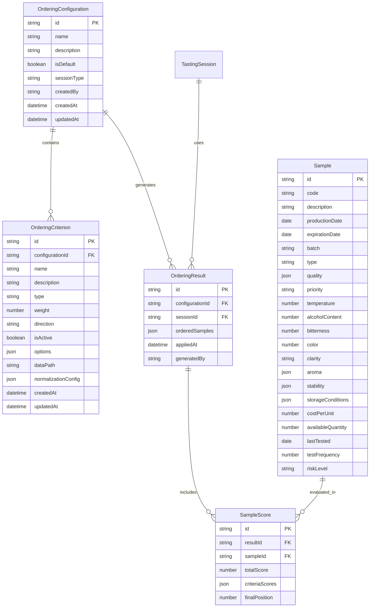

# Sistema de Ordenação Automática de Amostras

## 1. Diagrama de Entidades



## 2. Pseudocódigo do Algoritmo de Ordenação

```pseudocode
ALGORITMO OrderSamples(samples, configuration, sessionId, userId)
INÍCIO
    // 1. Validação de entrada
    SE samples.isEmpty() ENTÃO
        LANÇAR ERRO "Lista de amostras vazia"
    FIM SE
    
    SE configuration.criteria.filter(isActive).isEmpty() ENTÃO
        LANÇAR ERRO "Nenhum critério ativo"
    FIM SE
    
    // 2. Calcular peso total dos critérios ativos
    activeCriteria = configuration.criteria.filter(c => c.isActive)
    totalWeight = SOMAR(activeCriteria.map(c => c.weight))
    
    SE totalWeight = 0 ENTÃO
        LANÇAR ERRO "Peso total deve ser maior que zero"
    FIM SE
    
    // 3. Calcular score para cada amostra
    scores = []
    PARA CADA sample EM samples FAÇA
        sampleScore = CalculateSampleScore(sample, activeCriteria, totalWeight)
        scores.adicionar(sampleScore)
    FIM PARA
    
    // 4. Ordenar por score total (decrescente)
    scores = scores.ordenarPor(s => s.totalScore, DECRESCENTE)
    
    // 5. Aplicar posições finais
    PARA i = 0 ATÉ scores.length - 1 FAÇA
        scores[i].finalPosition = i + 1
    FIM PARA
    
    // 6. Ordenar amostras baseado nos scores
    orderedSamples = scores.map(score => 
        samples.encontrar(s => s.id = score.sampleId)
    )
    
    // 7. Retornar resultado
    RETORNAR OrderingResult {
        configurationId: configuration.id,
        sessionId: sessionId,
        orderedSamples: orderedSamples,
        scores: scores,
        appliedAt: AGORA(),
        generatedBy: userId
    }
FIM

FUNÇÃO CalculateSampleScore(sample, criteria, totalWeight)
INÍCIO
    criteriaScores = []
    
    PARA CADA criterion EM criteria FAÇA
        // Extrair valor da amostra
        rawValue = ExtractValue(sample, criterion.dataPath)
        
        // Normalizar valor (0-100)
        normalizedValue = NormalizeValue(rawValue, criterion)
        
        // Aplicar peso
        weightedScore = (normalizedValue * criterion.weight) / totalWeight
        
        criteriaScores.adicionar({
            criterionId: criterion.id,
            rawValue: rawValue,
            normalizedValue: normalizedValue,
            weightedScore: weightedScore
        })
    FIM PARA
    
    totalScore = SOMAR(criteriaScores.map(cs => cs.weightedScore))
    
    RETORNAR {
        sampleId: sample.id,
        totalScore: totalScore,
        criteriaScores: criteriaScores,
        finalPosition: 0
    }
FIM

FUNÇÃO NormalizeValue(value, criterion)
INÍCIO
    SE value = NULL ENTÃO
        RETORNAR criterion.normalizationConfig.defaultValue OU 0
    FIM SE
    
    normalized = 0
    
    ESCOLHA criterion.type
        CASO 'numeric':
            normalized = NormalizeNumeric(value, criterion)
        CASO 'date':
            normalized = NormalizeDate(value, criterion)
        CASO 'enum':
            normalized = NormalizeEnum(value, criterion)
        CASO 'boolean':
            normalized = value ? 100 : 0
        PADRÃO:
            normalized = 0
    FIM ESCOLHA
    
    // Aplicar direção
    SE criterion.direction = 'desc' ENTÃO
        normalized = 100 - normalized
    FIM SE
    
    RETORNAR normalized
FIM

FUNÇÃO NormalizeNumeric(value, criterion)
INÍCIO
    config = criterion.normalizationConfig
    SE config.min = INDEFINIDO OU config.max = INDEFINIDO ENTÃO
        RETORNAR MIN(100, MAX(0, value))
    FIM SE
    
    SE config.max = config.min ENTÃO
        RETORNAR 50
    FIM SE
    
    RETORNAR MIN(100, MAX(0, ((value - config.min) / (config.max - config.min)) * 100))
FIM

FUNÇÃO NormalizeDate(value, criterion)
INÍCIO
    date = CONVERTER_PARA_DATA(value)
    now = AGORA()
    maxDaysOld = criterion.normalizationConfig.max OU 30
    
    daysDiff = DIFERENÇA_EM_DIAS(now, date)
    
    SE daysDiff <= 0 ENTÃO
        RETORNAR 100
    FIM SE
    
    SE daysDiff >= maxDaysOld ENTÃO
        RETORNAR 0
    FIM SE
    
    RETORNAR MAX(0, 100 - (daysDiff / maxDaysOld) * 100)
FIM

FUNÇÃO NormalizeEnum(value, criterion)
INÍCIO
    options = criterion.options OU []
    index = options.indexOf(value)
    
    SE index = -1 ENTÃO
        RETORNAR 0
    FIM SE
    
    SE options.length = 1 ENTÃO
        RETORNAR 100
    FIM SE
    
    RETORNAR (index / (options.length - 1)) * 100
FIM
```

## 3. Estrutura de Tabelas/Collections

### 3.1 Tabela: ordering_configurations
```sql
CREATE TABLE ordering_configurations (
    id VARCHAR(255) PRIMARY KEY,
    name VARCHAR(255) NOT NULL,
    description TEXT,
    is_default BOOLEAN DEFAULT FALSE,
    session_type ENUM('routine', 'extra', 'all') DEFAULT 'all',
    created_by VARCHAR(255) NOT NULL,
    created_at TIMESTAMP DEFAULT CURRENT_TIMESTAMP,
    updated_at TIMESTAMP DEFAULT CURRENT_TIMESTAMP ON UPDATE CURRENT_TIMESTAMP,
    
    INDEX idx_session_type (session_type),
    INDEX idx_is_default (is_default),
    INDEX idx_created_by (created_by)
);
```

### 3.2 Tabela: ordering_criteria
```sql
CREATE TABLE ordering_criteria (
    id VARCHAR(255) PRIMARY KEY,
    configuration_id VARCHAR(255) NOT NULL,
    name VARCHAR(255) NOT NULL,
    description TEXT,
    type ENUM('numeric', 'date', 'enum', 'boolean') NOT NULL,
    weight INT NOT NULL CHECK (weight >= 1 AND weight <= 100),
    direction ENUM('asc', 'desc') DEFAULT 'desc',
    is_active BOOLEAN DEFAULT TRUE,
    options JSON,
    data_path VARCHAR(255) NOT NULL,
    normalization_config JSON,
    created_at TIMESTAMP DEFAULT CURRENT_TIMESTAMP,
    updated_at TIMESTAMP DEFAULT CURRENT_TIMESTAMP ON UPDATE CURRENT_TIMESTAMP,
    
    FOREIGN KEY (configuration_id) REFERENCES ordering_configurations(id) ON DELETE CASCADE,
    INDEX idx_configuration_id (configuration_id),
    INDEX idx_is_active (is_active)
);
```

### 3.3 Tabela: ordering_results
```sql
CREATE TABLE ordering_results (
    id VARCHAR(255) PRIMARY KEY,
    configuration_id VARCHAR(255) NOT NULL,
    session_id VARCHAR(255) NOT NULL,
    ordered_samples JSON NOT NULL,
    applied_at TIMESTAMP DEFAULT CURRENT_TIMESTAMP,
    generated_by VARCHAR(255) NOT NULL,
    
    FOREIGN KEY (configuration_id) REFERENCES ordering_configurations(id),
    FOREIGN KEY (session_id) REFERENCES tasting_sessions(id),
    INDEX idx_session_id (session_id),
    INDEX idx_configuration_id (configuration_id),
    INDEX idx_applied_at (applied_at)
);
```

### 3.4 Tabela: sample_scores
```sql
CREATE TABLE sample_scores (
    id VARCHAR(255) PRIMARY KEY,
    result_id VARCHAR(255) NOT NULL,
    sample_id VARCHAR(255) NOT NULL,
    total_score DECIMAL(5,2) NOT NULL,
    criteria_scores JSON NOT NULL,
    final_position INT NOT NULL,
    
    FOREIGN KEY (result_id) REFERENCES ordering_results(id) ON DELETE CASCADE,
    FOREIGN KEY (sample_id) REFERENCES samples(id),
    INDEX idx_result_id (result_id),
    INDEX idx_sample_id (sample_id),
    INDEX idx_final_position (final_position)
);
```

### 3.5 Extensão da Tabela: samples
```sql
ALTER TABLE samples ADD COLUMN (
    quality_score INT DEFAULT 50,
    quality_conformity ENUM('conforme', 'nao-conforme', 'pendente') DEFAULT 'pendente',
    quality_last_evaluation TIMESTAMP NULL,
    priority ENUM('baixa', 'media', 'alta') DEFAULT 'media',
    temperature DECIMAL(4,2) NULL,
    alcohol_content DECIMAL(4,2) NULL,
    bitterness INT NULL,
    color INT NULL,
    clarity ENUM('cristalina', 'turva', 'opaca') NULL,
    aroma_intensity INT NULL,
    aroma_quality INT NULL,
    stability_microbiological BOOLEAN DEFAULT TRUE,
    stability_physical BOOLEAN DEFAULT TRUE,
    stability_chemical BOOLEAN DEFAULT TRUE,
    storage_temperature DECIMAL(4,2) NULL,
    storage_humidity DECIMAL(4,2) NULL,
    storage_light ENUM('protegida', 'exposta') DEFAULT 'protegida',
    cost_per_unit DECIMAL(10,2) NULL,
    available_quantity INT NULL,
    last_tested TIMESTAMP NULL,
    test_frequency INT DEFAULT 7,
    risk_level ENUM('baixo', 'medio', 'alto') DEFAULT 'baixo'
);
```

## 4. Casos de Uso e Tratamento de Exceções

### 4.1 Casos Especiais

#### Valores Ausentes
- **Problema**: Amostra não possui valor para um critério
- **Solução**: Usar valor padrão definido na configuração de normalização
- **Implementação**: `normalizationConfig.defaultValue`

#### Critérios Conflitantes
- **Problema**: Múltiplos critérios com direções opostas
- **Solução**: Aplicar pesos proporcionais e normalização adequada
- **Implementação**: Sistema de pesos balanceados

#### Amostras com Scores Idênticos
- **Problema**: Múltiplas amostras com mesmo score total
- **Solução**: Usar critério de desempate (ex: data de produção)
- **Implementação**: Ordenação estável com critérios secundários

### 4.2 Validações de Entrada

```typescript
interface ValidationRules {
  configuration: {
    name: { required: true, minLength: 3, maxLength: 255 };
    criteria: { minItems: 1, maxItems: 20 };
    totalWeight: { min: 1, max: 1000, recommended: 100 };
  };
  criterion: {
    name: { required: true, minLength: 2, maxLength: 255 };
    weight: { min: 1, max: 100 };
    dataPath: { required: true, pattern: /^[a-zA-Z][a-zA-Z0-9._]*$/ };
    type: { enum: ['numeric', 'date', 'enum', 'boolean'] };
    direction: { enum: ['asc', 'desc'] };
  };
  samples: {
    minItems: 1;
    maxItems: 1000;
  };
}
```

### 4.3 Performance e Otimização

#### Complexidade Algorítmica
- **Tempo**: O(n * m) onde n = amostras, m = critérios ativos
- **Espaço**: O(n * m) para armazenar scores intermediários
- **Otimização**: Cache de valores normalizados para critérios estáticos

#### Estratégias de Cache
```typescript
interface CacheStrategy {
  normalizedValues: Map<string, number>; // Cache por amostra + critério
  configurationResults: Map<string, OrderingResult>; // Cache por configuração
  ttl: number; // Time to live em segundos
}
```

## 5. Documentação da API

### 5.1 Endpoints

#### POST /api/ordering/configurations
Cria nova configuração de ordenação
```typescript
interface CreateConfigurationRequest {
  name: string;
  description?: string;
  sessionType?: 'routine' | 'extra' | 'all';
  criteria: Omit<OrderingCriterion, 'id' | 'createdAt' | 'updatedAt'>[];
  isDefault?: boolean;
}
```

#### GET /api/ordering/configurations
Lista configurações disponíveis
```typescript
interface ListConfigurationsResponse {
  configurations: OrderingConfiguration[];
  pagination: {
    page: number;
    limit: number;
    total: number;
  };
}
```

#### POST /api/ordering/apply
Aplica ordenação a um conjunto de amostras
```typescript
interface ApplyOrderingRequest {
  configurationId: string;
  sessionId: string;
  sampleIds: string[];
}

interface ApplyOrderingResponse {
  result: OrderingResult;
  preview: {
    sample: Sample;
    score: number;
    position: number;
  }[];
}
```

#### POST /api/ordering/preview
Gera preview sem persistir
```typescript
interface PreviewOrderingRequest {
  criteria: OrderingCriterion[];
  sampleIds: string[];
}
```

### 5.2 Webhooks e Eventos

```typescript
interface OrderingEvents {
  'configuration.created': {
    configurationId: string;
    createdBy: string;
    timestamp: string;
  };
  
  'ordering.applied': {
    sessionId: string;
    configurationId: string;
    samplesCount: number;
    appliedBy: string;
    timestamp: string;
  };
  
  'ordering.failed': {
    sessionId: string;
    configurationId: string;
    error: string;
    timestamp: string;
  };
}
```

## 6. Testes e Qualidade

### 6.1 Casos de Teste

```typescript
describe('SampleOrderingEngine', () => {
  describe('orderSamples', () => {
    it('should order samples by single numeric criterion', () => {
      // Test implementation
    });
    
    it('should handle multiple criteria with different weights', () => {
      // Test implementation
    });
    
    it('should normalize date values correctly', () => {
      // Test implementation
    });
    
    it('should handle enum values with proper ordering', () => {
      // Test implementation
    });
    
    it('should throw error for invalid configuration', () => {
      // Test implementation
    });
  });
  
  describe('normalizeValue', () => {
    it('should normalize numeric values within range', () => {
      // Test implementation
    });
    
    it('should handle missing values with defaults', () => {
      // Test implementation
    });
  });
});
```

### 6.2 Métricas de Qualidade

- **Cobertura de Código**: Mínimo 90%
- **Complexidade Ciclomática**: Máximo 10 por função
- **Performance**: Ordenação de 1000 amostras em < 100ms
- **Precisão**: Scores calculados com precisão de 2 casas decimais

## 7. Monitoramento e Logs

### 7.1 Métricas de Sistema
```typescript
interface OrderingMetrics {
  configurationsCreated: Counter;
  orderingsApplied: Counter;
  orderingDuration: Histogram;
  orderingErrors: Counter;
  samplesProcessed: Counter;
}
```

### 7.2 Logs Estruturados
```json
{
  "timestamp": "2024-01-15T10:30:00Z",
  "level": "INFO",
  "event": "ordering_applied",
  "sessionId": "session-123",
  "configurationId": "config-456",
  "samplesCount": 25,
  "duration": 45,
  "userId": "user-789"
}
```

Esta documentação fornece uma base sólida para implementação, manutenção e evolução do sistema de ordenação automática de amostras.