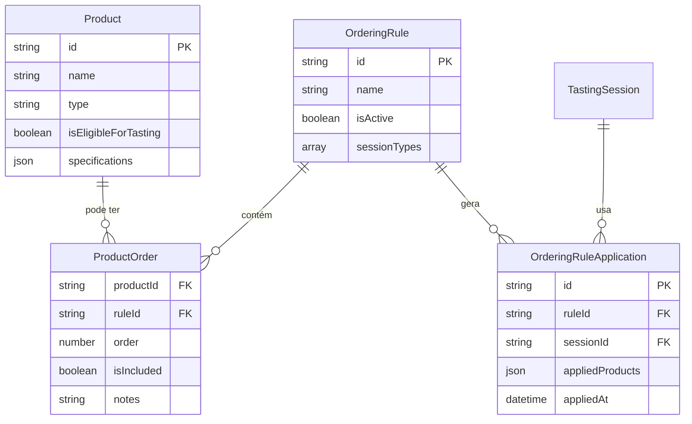

# Arquitetura do Sistema de Produtos e Ordenação

## 1. Modelo de Dados

### 1.1 Entidades Principais

#### Product (Produto)
```typescript
interface Product {
  id: string;
  name: string;
  description: string;
  type: string; // IPA, Lager, Pilsner, etc.
  category: string; // Artesanal, Premium, Standard
  abv: number; // Alcohol by volume
  ibu: number; // International Bitterness Units
  srm: number; // Standard Reference Method (color)
  isEligibleForTasting: boolean; // Toggle de elegibilidade
  specifications: ProductSpecifications;
  createdAt: string;
  updatedAt: string;
  createdBy: string;
}
```

#### OrderingRule (Regra de Ordenação)
```typescript
interface OrderingRule {
  id: string;
  name: string;
  description: string;
  isActive: boolean;
  sessionTypes: ('routine' | 'extra')[];
  productOrders: ProductOrder[];
  createdAt: string;
  updatedAt: string;
  createdBy: string;
}
```

#### ProductOrder (Ordem do Produto)
```typescript
interface ProductOrder {
  productId: string;
  order: number; // Posição na sequência (1, 2, 3...)
  isIncluded: boolean; // Se está incluído na regra
  notes?: string; // Observações específicas
}
```

### 1.2 Relacionamentos



## 2. Fluxo de Trabalho

### 2.1 Gerenciamento de Produtos

1. **Cadastro de Produtos**
   - Criação via modal com abas (Básico, Especificações, Armazenamento)
   - Validação de campos obrigatórios
   - Especificações técnicas detalhadas

2. **Elegibilidade para Degustação**
   - Toggle simples na listagem de produtos
   - Apenas produtos elegíveis aparecem nas regras de ordenação
   - Feedback visual imediato

3. **Filtros e Busca**
   - Busca por nome, descrição, tipo
   - Filtros por tipo, categoria, elegibilidade
   - Estatísticas em tempo real

### 2.2 Criação de Regras de Ordenação

1. **Configuração Básica**
   - Nome e descrição da regra
   - Tipos de sessão aplicáveis (rotina/extra)
   - Status ativo/inativo

2. **Seleção de Produtos**
   - Lista apenas produtos elegíveis
   - Checkbox para incluir/excluir
   - Observações específicas por produto

3. **Definição de Ordem**
   - **Drag & Drop**: Interface intuitiva para reordenação
   - **Dropdown**: Seleção numérica da posição (1, 2, 3...)
   - Sincronização automática entre métodos

### 2.3 Aplicação em Sessões

1. **Seleção Automática**
   - Sistema identifica regras ativas para o tipo de sessão
   - Aplica automaticamente a ordenação configurada
   - Gera amostras na sequência definida

2. **Flexibilidade**
   - Usuário pode sobrescrever a ordem automática
   - Possibilidade de excluir produtos específicos
   - Manter histórico de aplicações

## 3. Estrutura de Interface

### 3.1 Página de Produtos (`/products`)

```
┌─────────────────────────────────────────┐
│ Header: Gerenciamento de Produtos       │
│ [+ Novo Produto]                        │
├─────────────────────────────────────────┤
│ Stats Cards:                            │
│ [Total] [Elegíveis] [Não Elegíveis]     │
├─────────────────────────────────────────┤
│ Filtros:                                │
│ [Busca] [Tipo] [Elegibilidade]          │
├─────────────────────────────────────────┤
│ Tabela de Produtos:                     │
│ Nome | Tipo | ABV | IBU | [Toggle] | ⋮  │
│ ─────────────────────────────────────── │
│ IPA Premium | IPA | 6.5% | 65 | ✓ | ⋮  │
│ Lager Trad. | Lager | 4.8% | 25 | ✗ | ⋮ │
└─────────────────────────────────────────┘
```

### 3.2 Página de Regras (`/ordering-rules`)

```
┌─────────────────────────────────────────┐
│ Header: Regras de Ordenação             │
│ [+ Nova Regra]                          │
├─────────────────────────────────────────┤
│ Stats Cards:                            │
│ [Total] [Ativas] [Inativas] [Rotina]    │
├─────────────────────────────────────────┤
│ Tabela de Regras:                       │
│ Nome | Descrição | Tipos | Status | ⋮   │
│ ─────────────────────────────────────── │
│ Padrão Rotina | Ordem... | Rotina | ✓ |⋮│
└─────────────────────────────────────────┘
```

### 3.3 Modal de Criação de Regra

```
┌─────────────────────────────────────────┐
│ Nova Regra de Ordenação            [×]  │
├─────────────────────────────────────────┤
│ Informações Básicas:                    │
│ Nome: [________________]                │
│ Descrição: [___________]                │
│ Tipos: [✓] Rotina [✓] Extra             │
├─────────────────────────────────────────┤
│ Ordenação de Produtos:                  │
│ ┌─ [1] [✓] IPA Premium     [Dropdown] ─┐│
│ │  Obs: Finalizar com amargor      ≡   ││
│ ├─ [2] [✓] Pilsner Especial       ≡   ─┤│
│ ├─ [3] [✗] Lager Tradicional      ≡   ─┤│
│ └─────────────────────────────────────┘ │
├─────────────────────────────────────────┤
│ [Cancelar]              [Salvar Regra]  │
└─────────────────────────────────────────┘
```

## 4. Aplicação Dinâmica em Sessões

### 4.1 Integração com Criação de Sessões

```typescript
// No step de seleção de amostras
const applyOrderingRule = (sessionType: 'routine' | 'extra') => {
  // 1. Buscar regras ativas para o tipo de sessão
  const activeRules = orderingRules.filter(rule => 
    rule.isActive && rule.sessionTypes.includes(sessionType)
  );
  
  // 2. Aplicar a primeira regra encontrada (ou permitir seleção)
  const selectedRule = activeRules[0];
  
  // 3. Gerar amostras baseadas na regra
  const orderedProducts = selectedRule.productOrders
    .filter(po => po.isIncluded)
    .sort((a, b) => a.order - b.order);
  
  // 4. Criar amostras para cada produto
  const samples = orderedProducts.map(po => 
    generateSamplesForProduct(po.productId)
  ).flat();
  
  return samples;
};
```

### 4.2 Persistência de Aplicações

```typescript
interface OrderingRuleApplication {
  id: string;
  ruleId: string;
  sessionId: string;
  appliedProducts: {
    productId: string;
    finalOrder: number;
    samples: string[]; // IDs das amostras geradas
  }[];
  appliedAt: string;
  appliedBy: string;
}
```

## 5. Benefícios da Arquitetura

### 5.1 Flexibilidade
- **Múltiplas regras** por tipo de sessão
- **Configuração granular** por produto
- **Sobrescrita manual** quando necessário

### 5.2 Rastreabilidade
- **Histórico** de aplicações de regras
- **Auditoria** de mudanças
- **Relatórios** de uso

### 5.3 Escalabilidade
- **Fácil adição** de novos produtos
- **Regras complexas** com múltiplos critérios
- **Integração** com sistemas externos

### 5.4 Usabilidade
- **Interface intuitiva** com drag & drop
- **Feedback visual** imediato
- **Validações** em tempo real

## 6. Implementação Técnica

### 6.1 Componentes Principais
- `ProductsManagement`: Listagem e CRUD de produtos
- `ProductDialog`: Modal de criação/edição
- `OrderingRulesManagement`: Gestão de regras
- `OrderingRuleDialog`: Configuração de regras
- `SortableProductItem`: Item arrastável com dnd-kit

### 6.2 Hooks e Serviços
- `useProducts`: Gerenciamento de estado dos produtos
- `useOrderingRules`: Gestão das regras de ordenação
- `orderingService`: Aplicação de regras em sessões

### 6.3 Validações
- Produtos elegíveis para regras
- Ordem sequencial sem gaps
- Pelo menos um produto por regra
- Tipos de sessão válidos

Esta arquitetura fornece uma base sólida para o gerenciamento completo do ciclo de vida dos produtos e suas regras de ordenação no sistema B-Tasting.